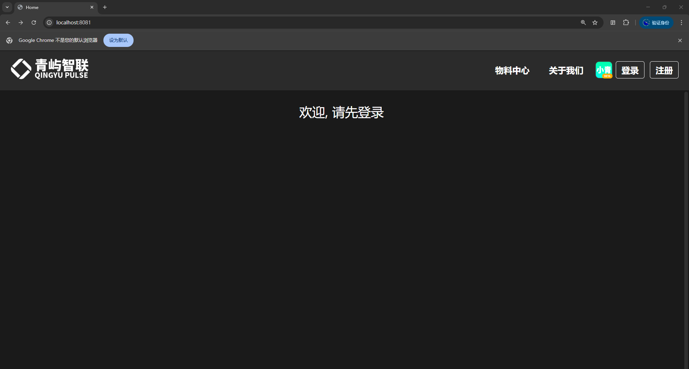
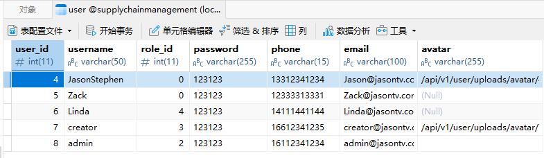

# 使用说明

<h6 style="text-align: center">← 1.2 [[硬件与安装指南]] | 1.3 使用说明 | 2.1 [[功能介绍]] →</h6>

**<< 返回[[欢迎]]**

## 如何使用本项目

*在正式使用本项目前，请确保您已经仔细阅读1.2 [[硬件与安装指南]]的内容，安装并配置完毕。

### 步骤1：注册一个新的账户

### 步骤2：前往Navicat对角色权限进行修改（作者忘记在项目中设置这个功能了）
在数据库中，对user表中用户的role_id进行修改，来更改他的角色

您可以在项目的 `用户信息-角色管理/权限管理` 对角色和权限进行调整和新的绑定。

**项目的默认角色配置表如下：**

| 角色   | role_id |
| ---- | ------- |
| 普通用户 | 4       |
| 企业用户 | 0       |
| 管理员  | 2       |
| 创世神  | 3       |

**这是我们的默认权限表：**

|中文名|英文名|角色|权限Code|解释|
|---|---|---|---|---|
|默认权限|Default Permission|普通用户|DEFAULT_PERMISSION|证明你有权限|
|角色设置|Role Create|管理员|ROLE_CREATE|设置角色|
|权限绑定|Permission Bind|管理员|PERMISSION_BIND|绑定角色和权限|
|创造权限|Permission Create|创世神|PERMISSION_CREATE|权限创造 [创世神]|
|产品/材料查看|Goods View|普通用户|GOODS_VIEW|查看产品或材料信息|
|产品/材料管理|Goods Set|管理员|GOODS_SET|管理产品或者材料|
|产品类别管理|Goods Category|企业用户|GOODS_CATEGORY|管理产品类别|
|配方管理|Set Component|企业用户|SET_COMPONENT|管理产品配方|
|产品库存显示|Inventory Show|企业用户|INVENTORY_SHOW|显示库存信息|
|设置库存告警|Set Inventory Alert|企业用户|SET_INVENTORY_ALERT|设置库存告警|
|增加或减少库存|Change Inventory|创世神|CHANGE_INVENTORY|库存调整 [创世神]|
|生产产品|Good Produce|企业用户|GOOD_PRODUCE|产品被生产|
|订单查看|Order View|企业用户|ORDER_VIEW|查看可被处理的订单|
|对象管理|Object Management|创世神|OBJECT_MANAGEMENT|客户/供应商/物流公司管理 [创世神]|
|对象订单创造|Object Order Create|创世神|OBJECT_ORDER_CREATE|供应商和客户的订单创建 [创世神]|
|买卖管理|Order Setup|企业用户|ORDER_SETUP|公司采购或销售产品|

调整为对应的权限后，就可以进行相应的访问了。

**💡看完了？接下来去我们的[[功能介绍]]吧 >>>**
<h6 style="text-align: center">← 1.2 [[硬件与安装指南]] | 1.3 使用说明 | 2.1 [[功能介绍]] →</h6>