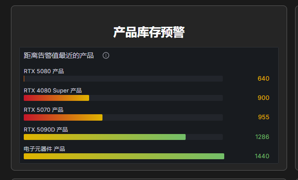
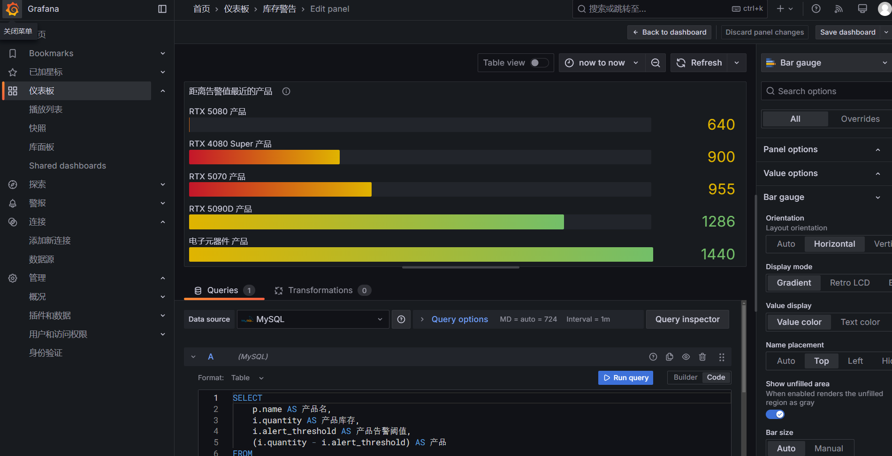
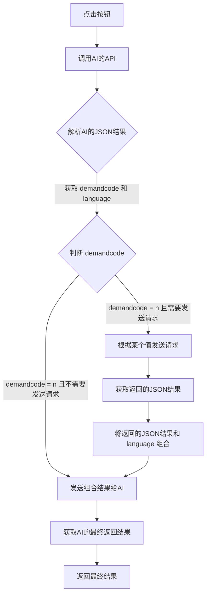

# 2.2 创新功能

<h6 style="text-align: center">← 2.1 [[功能介绍]] | 2.2 创新功能 | 2.3 [[数据库设计]] →</h6>

**<< 返回[[欢迎]]**

## 1. 前言
本项目中的创新功能是除了大学期间学习的前后端项目外进行的一些大胆尝试，这其中包括一些实用功能比如csv表单导出，也包括大数据专业的数字监控大屏，以及当今非常热门的AI集成。

其中本项目最引以为傲的创新项目主要就是人工智能的引入，2025年作为AI元年之一，不论是国内还是国外，AI都在相互追赶。本项目接入了Deepseek大模型，接入智联小青，使用户查询指定的信息时能更加方便。

## 2. CSV表单导出功能
CSV表单导出功能被用于物流订单（成交订单）的信息导出，方便用户在端外进行分析，使用OpenCSV库实现CSV表单导出功能。

**实现方法：**

```java
public byte[] exportLogisticsOrdersToCsv(List<LogisticsOrder> orders) throws IOException {  
	ByteArrayOutputStream outputStream = new ByteArrayOutputStream();  
	OutputStreamWriter writer = new OutputStreamWriter(outputStream);  
	CSVWriter csvWriter = new CSVWriter(writer);  
	  
	// 写入CSV头部  
	String[] header = {  
		"物流ID", "订单类型", "客户/供应商", "产品", "数量", "单价", "总价", "物流状态", "订单状态"  
	};  
	csvWriter.writeNext(header);  
	  
	// 写入数据行  
	for (LogisticsOrder order : orders) {  
		String orderType = order.getPurchaseOrderId() != null ? "采购订单" : "销售订单";  
		String customerOrSupplierName = "";  
		String productName = "";  
		String quantity = "";  
		String unitPrice = "";  
		String totalPrice = "";  
		String orderStatus = "";  
		  
		if (order.getPurchaseOrderId() != null) {  
			customerOrSupplierName = order.getPurchaseOrder().getSupplier() != null ? order.getPurchaseOrder().getSupplier().getName() : "N/A";  
			productName = order.getPurchaseOrder().getProduct() != null ? order.getPurchaseOrder().getProduct().getName() : "N/A";  
			quantity = String.valueOf(order.getPurchaseOrder().getQuantity());  
			unitPrice = String.valueOf(order.getPurchaseOrder().getUnitPrice());  
			totalPrice = String.valueOf(order.getPurchaseOrder().getTotalPrice());  
			orderStatus = mapPurchaseOrderStatus(order.getPurchaseOrder().getStatus());  
		} else if (order.getSalesOrderId() != null) {  
			SalesOrder salesOrder = order.getSalesOrder();  
			if (salesOrder != null) {  
				salesOrder.setCustomer(customerService.getCustomerById(salesOrder.getCustomerId()));  
				salesOrder.setProduct(productService.getProductById(salesOrder.getProductId()));  
			}  
			customerOrSupplierName = salesOrder.getCustomer() != null ? salesOrder.getCustomer().getName() : "N/A";  
			productName = salesOrder.getProduct() != null ? salesOrder.getProduct().getName() : "N/A";  
		}  
		  
		String[] data = {  
			String.valueOf(order.getLogisticsOrderId()),  
			orderType,  
			customerOrSupplierName,  
			productName,  
			quantity,  
			unitPrice,  
			totalPrice,  
			mapLogisticsStatus(order.getStatus()),  
			orderStatus  
		};  
		csvWriter.writeNext(data);  
	}  
	  
	csvWriter.close();  
	writer.close();  
	outputStream.close();  
	  
	return outputStream.toByteArray();  
}
```

**调用接口详见[[接口文档]]**

## 2. 数字可视化监控大屏
在我们的项目中加入了一些监控大屏，具体效果如下：



我们采用Grafana来实现这些功能，具体编辑页面如下：



Grafana相比Echart具有众多优点，包括但不限于，可直接使用SQL语句，与Spring Boot项目分离开发，制作好的图标使用Iframe框架引入到前端。

## 3. AI集成（基于DeepSeek v2.5 & v3）
AI集成在现代供应链管理系统以及其他领域都起着关键性的作用，在本项目中可以将查询变得更加容易，操作更加简单。我们使用国产AI大模型DeepSeek做为驱动，能够精准判断。

### 3.1 大类功能列表

| 功能类别 | 返回Status |
| ---- | -------- |
| 对话功能 | 0x       |
| 查询功能 | 1x       |
| 彩蛋功能 | 9x       |
| 错误   | 99       |

### 3.2 大致实现思路

### 3.3 硅基流动接口访问
```java
String requestBody = """
    {
        "model": "deepseek-ai/DeepSeek-V3",
        "messages": [
            {
                "role": "user",
                "content": "<content>"
            }
        ],
        "stream": false,
        "max_tokens": 512,
        "stop": null,
        "temperature": 0.7,
        "top_p": 0.7,
        "top_k": 50,
        "frequency_penalty": 0.5,
        "n": 1,
        "response_format": {
            "type": "text"
        },
        "tools": [
            {
                "type": "function",
                "function": {
                    "description": "<string>",
                    "name": "<string>",
                    "parameters": {},
                    "strict": false
                }
            }
        ]
    }
    """;

HttpResponse<String> response = Unirest.post("https://api.siliconflow.cn/v1/chat/completions")
    .header("Authorization", "Bearer " + token)
    .header("Content-Type", "application/json")
    .body(requestBody)
    .asString();
```


### 3.4 查询功能接口与描述对照表
#### 3.4.1 用户需求和状态对照表
##### 3.4.1.1 总表需求对照表

| 用户的需求                                         | demand code |
| --------------------------------------------- | ----------- |
| 正常交流                                          | 00          |
| 不理解用户的意思                                      | 01          |
| 用户交流彩蛋（你认为用户比较有趣）                             | 02          |
| 查询产品                                          | 10          |
| 库存告警查询                                        | 11          |
| 订单查询                                          | 12          |
| 彩蛋（用户的词中必须包括例如表演的词汇（否则demandCode算02），给他们表演一个） | 90          |
##### 3.4.1.2 查询产品需求扩展

| 用户的需求                | demand code |
| -------------------- | ----------- |
| 查询产品，且明确查询的内容或查询所有产品 | 10A         |
| 查询产品，未明确查询内容         | 10B         |

##### 3.4.1.3 订单查询需求扩展

| 用户的需求          | demand code |
| -------------- | ----------- |
| 查询的是进行中的或物流的订单 | 12A         |
| 查询的是供应或采购订单    | 12B         |
| 查询的是销售订单       | 12C         |
| 查询所有订单         | 12Y         |
| 未明确查询订单的类别或内容  | 12Z         |

##### 3.4.1.4 用户需求与status对照总表
| 用户的需求                                         | demand code |
| --------------------------------------------- | ----------- |
| 正常交流                                          | 00          |
| 不理解用户的意思                                      | 01          |
| 用户交流彩蛋（你认为用户比较有趣）                             | 02          |
| 查询产品，且明确查询的内容或查询所有产品                          | 10A         |
| 查询产品，未明确查询内容                                  | 10B         |
| 库存告警查询                                        | 11          |
| 查询的是进行中的或物流的订单                                | 12A         |
| 查询的是供应或采购订单                                   | 12B         |
| 查询的是销售订单                                      | 12C         |
| 查询所有订单                                        | 12Y         |
| 未明确查询订单的类别或内容                                 | 12Z         |
| 彩蛋（用户的词中必须包括例如表演的词汇（否则demandCode算02），给他们表演一个） | 90          |
| 错误（不再需求中）                                     | 99          |

#### 3.4.2 提示词对照表
##### 步骤1：用户提出需求，AI判断用户的需求代码和语言。
你是一个AI机器人。用户向你提问了{content}，请根据用户的需求返回对应的demandCode，并判断用户的提问语言（如果用户明确要求回复语言，以用户要求为准），输出language，并将demandCode和language输出为JSON。

需求代码对照如下：

| 用户的需求                      | demandCode |
| -------------------------- | ---------- |
| 正常交流                       | 00         |
| 不理解用户的意思                   | 01         |
| 用户交流菜单（你认为用户比较有趣）          | 02         |
| 查询产品，且明确查询的内容或查询所有产品       | 10A        |
| 查询产品，未明确查询内容               | 10B        |
| 库存告警查询                     | 11         |
| 查询的是进行中的或物流的订单             | 12A        |
| 查询的是供应或采购订单                | 12B        |
| 查询的是销售订单                   | 12C        |
| 查询所有订单                     | 12Y        |
| 未明确查询订单的类别或内容              | 12Z        |
| 彩蛋（触发关键词表演（否则算可爱），给他们表演一个） | 90         |

输入内容
```json
我想查询 RTX 4090
```

输出结果：
```json
{
  "demandCode": "10A",
  "language": "Chinese"
}
```

##### 步骤2：将JSON信息返回给AI
通过switch case的方法，判断demandCode是多少，并执行不同的函数操作，同时将content和language再次传递给AI。具体提示词如下：

###### 1. 正常交流👄（00）
你是AI客服小青，你的用户想和您进行正常的交流沟通，他发送的内容是{content}，请您使用{language}语言进行交流。

###### 2. 用户需求不明确❓（01）
你是AI客服小青，但是用户提的问题不清晰，请您使用{language}语言告诉他他提的问题不清晰。

###### 3. 用户非常的可爱😊（02）
你是AI客服小青，你的用户提了一个非常可爱的问题，请您使用{language}跟他说下面的话：“您真是太可爱了，恭喜获得年度最可爱用户称号”

###### 4. 用户明确了查询的产品📦 （10A）
###### (1) 需要先让AI了解你问的是什么产品（请求接口/product-categories，返回{CategoryDetails}）
你是AI客服小青，用户的问题是：{content}。数据库中的产品共分为这些类别： {CategoryDetails}。请你按词拆分并判断用户想要查询的产品名称 {query}和 产品类别{category_name}，如果用户要求查询所有的产品，则不输出{query}。请只输出JSON，包含产品名称 {query}和 产品类别{category_name}，如果用户没有指定查询的类别，则不输出{category_name}。

###### (2)接下来返回的结果（请求接口/ai/product/search 附带参数，返回{SearchResult}）
你是AI机器人小青，你的用户想要查询的产品信息如下：{SearchResult}（如果没有内容就是没有结果）。请您用一段简短的话用{language}语言将产品信息介绍给他（注意不要提及任何和编号有关的内容）。

###### 5. 用户不明确查询的是什么产品📦❓（10B）
你是AI机器人小青，你的用户并没有明确查询的是什么产品，请您提醒他。

###### 6. 库存预警查询💻（11）
你是AI机器人小青，以下是库存告警的产品信息：{ResultData}（如果没有内容就是没有告警产品）。请您用一段简短的话用{language}语言将告警信息告诉他，请告诉用户产品库存不足(不需要说几件)，并给他建议。

###### 7. 进行中的订单或物流订单查询📦（12A）
你是AI机器人小青，以下是所有进行中或已完成的订单信息：{ResultData}（如果没有内容就是没有物流订单）。请您用一段简短的话用{language}语言将物流订单信息介绍给他。其中purchase或sales的order的status为3为已完成，2为进行中，1为待签署，0为待成交；logistics-order的status为0为进行中，1为已完成，2为待签收。重点告诉用户进行中的和待签收的订单信息

###### 8. 供应或采购订单查询📦（12B）
你是AI机器人小青，以下是所有待成交的采购订单信息：{ResultData}（如果没有内容就是没有采购订单）。请您用一段简短的话用{language}语言将status为0(待接单的)的采购订单信息告诉他。

###### 9. 销售订单查询📦（12C）
你是AI机器人小青，以下是所有待成交的销售订单信息：{ResultData}（如果没有内容就是没有销售订单）。请您用一段简短的话用{language}语言将status为0(待接单的)的采购订单信息告诉他。
###### 10. 所有订单查询（包括销售订单和采购订单）📦（12Y）
你是AI机器人小青，以下是所有待成交的订单信息（包括供应和销售）：{ResultData}（如果没有内容就是没有订单）。请您用一段简短的话用{language}语言将所有信息告诉他。
###### 11. 不清楚查询什么类型的订单📦❓（12Z）
你是AI机器人小青，你的用户并没有明确查询的是什么类型的订单，请您提醒他。
###### 12. 触发彩蛋🥚（90）


**💡看完了？接下来去我们的[[数据库设计]]吧 >>>**

<h6 style="text-align: center">← 2.1 [[功能介绍]] | 2.2 创新功能 | 2.3 [[数据库设计]] →</h6>