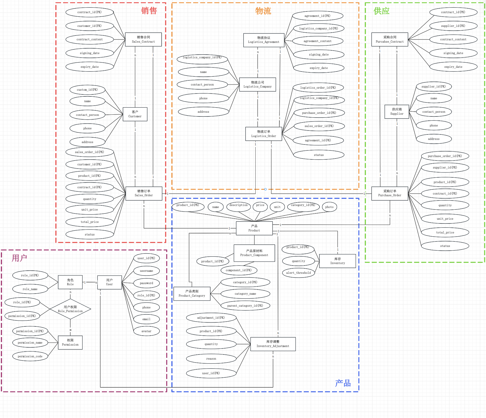

# 1.1 简介

<h6 style="text-align: center">← [[欢迎]] | 1.1 简介 |1.2 [[硬件与安装指南]] →</h6>

**<< 返回[[欢迎]]**

通过这部分，你可以初步了解到我们为什么会选择这个课题，如何去制作这个课题。

## 1. 什么是供应链管理系统
供应链管理系统顾名思义就是一个系统，一个能对产业上中下游链接在一起的高效管理系统。目的是整合并优化供应链的运作，降本增效。

在我们的项目中，供应链管理系统主要包含了多个角色：供应商，客户，我（企业用户），物流。将角色绑定在一起，提高效率。所以供应链管理系统是现代企业运营中不可分割的一部分。

但是现在的供应链管理系统已经从现代供应链管理系统逐步向人工智能加持的供应链管理系统转变。从2022年底开始，以[Chat-GPT](https://chat.openai.com/) 为首的大语言模型GPT-3横空出世后，人们逐渐意识到人工智能在社会中的重要地位；对于我们来说，2025年是属于我们国家大语言模型腾飞的一年，Deepseek V3和R1的横空出世，再次向世界证明了AI的强大。对于国人而言，Deepseek为大家带来了更便宜，门槛更低的AI，对企业来说，更是如此。微软，AMD，NVIDIA等众多国内与世界的龙头企业相继接入Deepseek大语言模型，生产效率大大提升。

## 2. 为什么选择供应链管理系统这个课题
不得不说，选择供应链管理系统其实灵感来自一款来自Colossal Order开发的游戏——都市天际线2（虽然如今的实际成品与当时幻想的出入非常大）。城市就像是一个庞大的自动化系统，而其中的供应链管理系统更是吸引了我的注意。

起初我对这个项目的开发愿景是非常宏观的，以至于老师们都劝我不要做这么大规模的以城市为规模的供应链管理系统。确实，在深入研究后，我发现这么做不要说制作了，连演示都成问题。所以在开题答辩后，我决定将课题缩小为针对一个企业的供应链管理系统。

## 3. 如何设计供应链管理系统
在起初的构思中，我决定将供应链管理系统分为六个部分，供应，销售，物流，产品，材料和用户。但是后来我发现，如果将材料和产品分开会导致通信上的复杂度直线上升。所以最后决定将产品和材料合并，并补上库存管理的部分。

而在角色设计方面，我们将角色分为四个等级：
1. 游客：未登录的用户，或者无权限登录用户，通常只能访问产品信息和关于我们页。
2. 企业用户：企业内部的用户，可以进行一些产品管理，配方管理，生产和交易的功能。
3. 管理员：企业内部的高级用户，可以进行产品的添加删除，对现有的角色和权限进行管理。
4. 创世神（超级管理员）：理论上不应该存在的角色，但是因为演示需要而存在。可以添加角色权限，添加外部角色和订单，添加删除库存产品等高风险权限。

在设计模块时，我们将用户信息和创世神功能单独归为用户信息页。此外划分物料中心，产品作坊，买卖中心三个板块。除此之外，在后期的开发中，我们加入了AI，这是提升我们供应链管理系统效率的关键一步。

**💡看完了？接下来去我们的[[硬件与安装指南]]吧 >>>**

<h6 style="text-align: center">← [[欢迎]] | 1.1 简介 |1.2 [[硬件与安装指南]] →</h6>